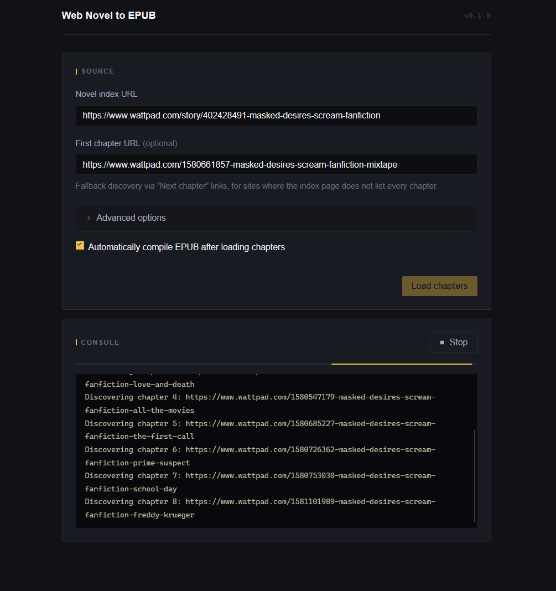
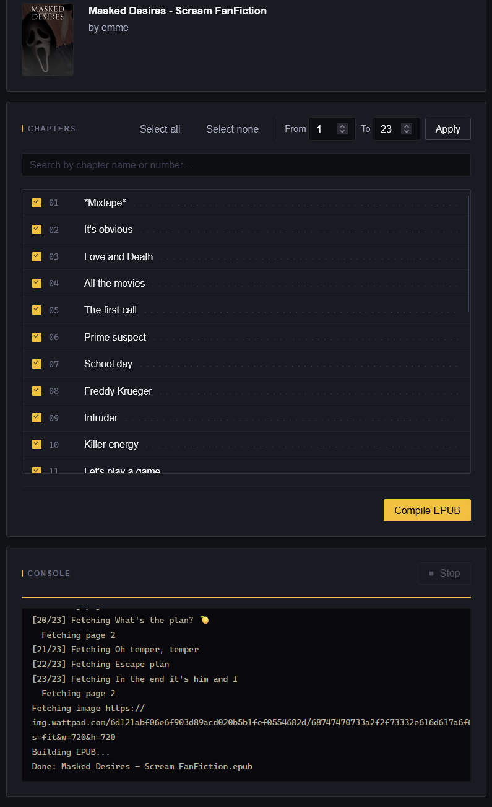

<h3 align="center">Web Novel to EPUB</h3>

  A Firefox extension that turns web novel chapters into a single EPUB file, cover art and all.
   
   
  <a href="https://github.com/TheJaydenProject/webnovel-to-epub/issues/new?template=bug_report.md">Report a Bug</a>
  &nbsp;·&nbsp;
  <a href="https://github.com/TheJaydenProject/webnovel-to-epub/issues/new?template=feature_request.md">Request a Feature</a>
  &nbsp;·&nbsp;
  <a href="https://github.com/TheJaydenProject/webnovel-to-epub/issues/new?template=site_request.md">Request a Site</a>

## About The Project

A browser extension for downloading web novels as EPUB files. Give it a TOC page, select your chapters, and it packages the content with cover art and images into a compressed EPUB.

- Reads the TOC page automatically to pull the title, author, chapter list, and cover art without any manual input
- Handles Cloudflare-protected and login-gated sites by loading pages in a real background tab using your existing browser session
- WuxiaWorld users get their API token auto-filled from an open wuxiaworld.com tab
- EPUB output is DEFLATE-compressed at level 9, so file sizes stay small
- Auto-compile is on by default -- no need to click Compile after chapters finish loading
- A Stop button lets you bail out early and still get an EPUB with whatever was fetched

14 sites verified and working. More added on request.

### Built With

- [Firefox Extension APIs (Manifest V3)](https://developer.mozilla.org/en-US/docs/Mozilla/Add-ons/WebExtensions)
- [JSZip](https://stuk.github.io/jszip/)

## Getting Started

No build step needed. Load the extension directly into Firefox as a temporary add-on.

### Prerequisites

- Firefox (any recent version)

### Installation

1. Go to `about:debugging` in Firefox
2. Click **This Firefox**
3. Click **Load Temporary Add-on...**
4. Select `manifest.json` from this folder

The extension icon will appear in your toolbar.

## Usage

1. Open the novel's table-of-contents page in Firefox (the series or index page, not a chapter page)
2. Click the extension icon -- the TOC URL fills in automatically
3. Optionally fill in a **First chapter URL** if the TOC does not list every chapter; the extension will walk "Next chapter" links from there
4. Click **Load chapters**
5. Use **Select all / Select none**, the **From / To** range, or the search box to pick what you want
6. Click **Compile EPUB** (or let auto-compile handle it)

The EPUB downloads automatically when done.

### Tips

- **Sites behind Cloudflare or a login wall** -- "Use browser tab for fetching" is on by default. Just make sure you are logged in to the site before loading.
- **Sites with incomplete TOC pages** -- fill in the First chapter URL and the extension follows "Next chapter" links through the whole series.
- **WuxiaWorld** -- keep a wuxiaworld.com tab open while logged in and the extension fills your API token for you.
- **Stopping early** -- click Stop at any point. You still get an EPUB from whatever chapters were fetched.

### Advanced Options

| Option | Default | Description |
|--------|---------|-------------|
| Use browser tab for fetching | On | Loads pages in a real background tab -- required for Cloudflare-protected or login-gated sites |
| Auto-compile after loading | On | Skips the manual Compile step |
| WuxiaWorld API token | Auto | Filled from an open wuxiaworld.com tab |

## Supported Sites

14 verified sites -- click to expand

Sites are configured in `core/ParserRegistry.js`. All of these have been tested end-to-end and produced a working EPUB.

- [wattpad.com](https://www.wattpad.com) - last verified 2026-06-15
- [royalroad.com](https://www.royalroad.com) - last verified 2026-06-15
- [scribblehub.com](https://www.scribblehub.com) - last verified 2026-06-15
- [wuxiaworld.com](https://www.wuxiaworld.com) - last verified 2026-06-14
- [novelbin.com](https://novelbin.com) / [novelbin.me](https://novelbin.me) - last verified 2026-06-15
- [novelbuddy.com](https://novelbuddy.com) - last verified 2026-06-15
- [novelfire.net](https://novelfire.net) - last verified 2026-06-15
- [novelarrow.com](https://novelarrow.com) - last verified 2026-06-15
- [novelverse.online](https://novelverse.online) - last verified 2026-06-15
- [ranovel.com](https://ranovel.com) - last verified 2026-06-15
- [wetriedtls.com](https://wetriedtls.com) - last verified 2026-06-15
- [dreamy-translations.com](https://dreamy-translations.com) - last verified 2026-06-14
- [dreambigtl.com](https://www.dreambigtl.com) - last verified 2026-06-15
- [fenrirealm.com](https://fenrirealm.com) - last verified 2026-06-15

## Requesting a New Site

[Open a site request](https://github.com/TheJaydenProject/webnovel-to-epub/issues/new?template=site_request.md) and include:

- The novel's index/table-of-contents URL
- A link to a sample chapter page
- Whether the site requires a login to read chapters

## Roadmap

- [ ] Chrome / Chromium support
- [ ] More site parsers

See the [open issues](https://github.com/TheJaydenProject/webnovel-to-epub/issues) for a full list of proposed features and known issues.

## Contributing

Contributions are welcome.

1. Fork the project
2. Create a feature branch (`git checkout -b feature/something`)
3. Commit your changes
4. Push to the branch
5. Open a pull request

## License

Distributed under the MIT License. See [LICENSE](LICENSE) for more information.

## Contact

Project Link: [https://github.com/TheJaydenProject/webnovel-to-epub](https://github.com/TheJaydenProject/webnovel-to-epub)
